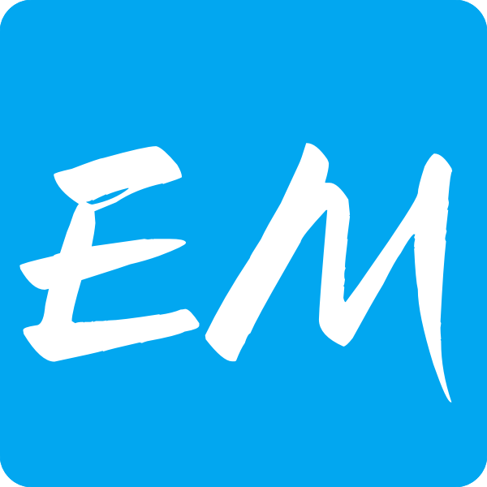
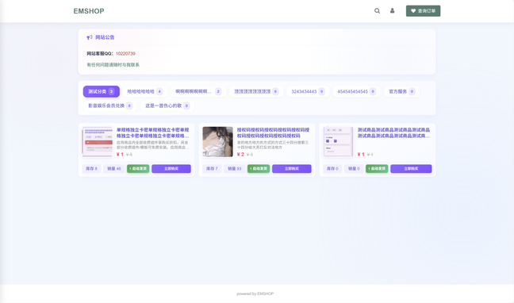
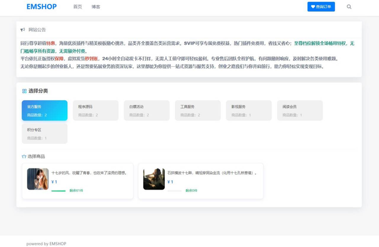

<!-- LOGO 区：已修复尺寸与间距，便于在博客中展示 -->

  

    
  

  <h2 style="font-size:22px;color:#2d3748;margin:0 0 8px;">EMSHOP</h2>
  

    PHP 7.4
    MySQL ≥ 5.6
    GPLv3
  

  
发卡系统 · 虚拟商品交易一站式解决方案

在虚拟商品（激活码、CDK、会员资格、数字资源等）的展示与交易场景中，一款稳定、高效且易扩展的发卡系统能显著提升用户和运营体验。EMSHOP 作为开源社区中的优质选项，凭借功能全面、部署简单与灵活定制，广受好评。下面我们来逐项解析它的核心亮点与适用场景。

## 🎨 多风格模板展示
EMSHOP 内置多套精致模板，适配不同商品展示场景，支持一键切换与自定义样式。

  <!-- 模板示例：使用图片占位，发布时替换为真实截图 -->
  

    
  

  

    
  

  

    
  

## 🌐 分站模板（多站点支持）
EMSHOP 提供分站模板，适合多品牌或多站点运营场景，可独立管理品牌展示与结算配置。

  

    <h4 style="color:#2d3748;margin:0 0 8px;font-size:16px;font-weight:600;">分站专属模板</h4>
    
    
适配场景：多站点运营、子品牌独立展示与管理

  

## 🚀 EMSHOP 核心功能亮点
EMSHOP 以“实用、高效、灵活”为设计理念，覆盖虚拟商品管理与交易的全流程需求：

1. 零技术门槛部署，快速上线  
   - 原生 PHP 7.4 开发、无第三方框架依赖；仅需上传文件 + 导入数据库，10 分钟完成部署，适合非技术用户快速上手。

2. 全品类商品管理，灵活适配  
   - 支持软件激活码、游戏 CDK、虚拟会员、数字课程、素材资源等；每类商品可配置独立库存与发货规则，有效避免超卖。

3. 自动化交易流程，高效便捷  
   - 集成自动发货（激活码、直连链接等），支付完成后实时发货，减少人工干预并提升成交效率。

4. 多支付方式集成，覆盖主流渠道  
   - 支持微信支付、支付宝、PayPal 等，按需启用不同支付渠道以提升转化率。

5. 高度可定制，支持插件化扩展  
   - 支持自定义 LOGO、配色、模板布局，并提供插件机制（支付、通知、第三方集成等），方便二次开发与功能扩展。

6. 完善的数据统计与后台监控  
   - 内置订单、销量、交易金额等统计模块，支持按时间维度或商品维度分析运营数据，为决策提供依据。

7. 内置博客/文档模块，助力内容运营  
   - 自带博客功能，可发布教程、使用指南与行业资讯，提升用户留存并有利于 SEO 优化。

## ⚙️ 技术架构与兼容性
- 开发语言：原生 PHP 7.4  
- 数据库：MySQL 5.6 及以上  
- 兼容性：适配 Apache、Nginx，支持 Windows / Linux 部署  
- 扩展性：插件化设计，支持二次开发与自定义接口  
- 授权协议：GPLv3（开源免费，可修改、分发）

## 📌 适用场景
- 软件开发者：发布与售卖软件激活码、授权证书  
- 游戏运营者：售卖游戏 CDK、道具、会员资格  
- 内容创作者：发布数字课程、模板、素材等虚拟商品  
- 企业用户：提供在线激活、会员开通等服务  
- 个人用户：搭建个人虚拟商品店铺或资源分享平台

---

EMSHOP 以“开源免费、功能全面、部署便捷”为优势，适合个人与企业快速搭建稳定的发卡系统，显著降低开发与运营成本，是寻求可靠发卡解决方案时值得尝试的工具。
